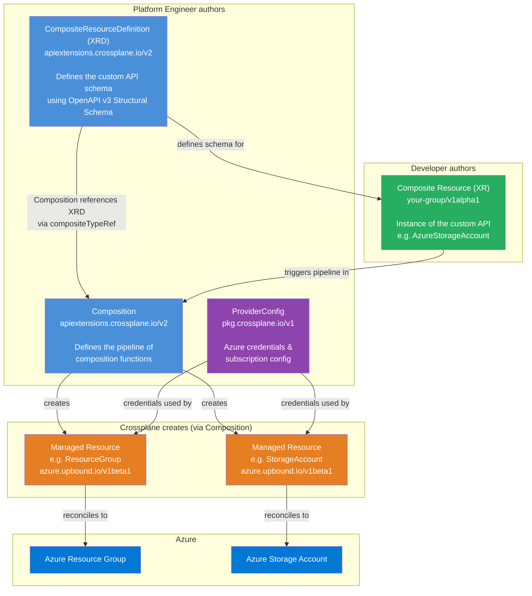

# Diagram: Crossplane Object Model (Level 1 — High)

This diagram shows the **entire Crossplane object model** and how the five main kinds relate to each other and to Azure.

## Key points from this diagram

- **Blue (Platform)**: Objects the platform engineer writes. The XRD is the schema contract; the Composition is the implementation.
- **Green (Developer)**: The XR is what developers create. Its structure is defined by the XRD schema.
- **Orange (Managed Resources)**: Created automatically by Crossplane. The developer never writes these directly.
- **Azure Blue**: The real cloud resources. Each MR maps 1-to-1 to an Azure resource.
- The `compositeTypeRef` in a Composition binds it to an XRD — this is the critical link between schema and implementation.
