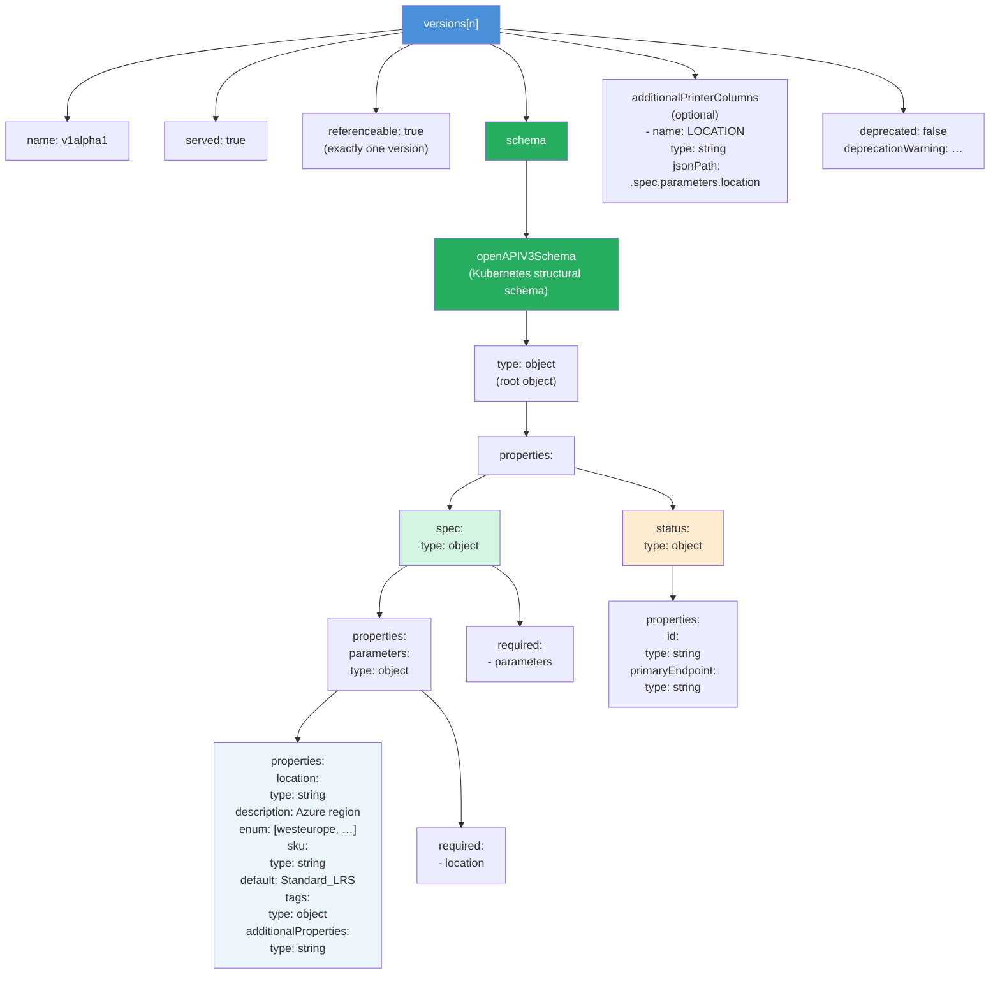

# Diagram: XRD versions[].schema.openAPIV3Schema (Level 3 — Low / Field)

This diagram drills into a single version entry — specifically the `openAPIV3Schema` subtree that defines the developer-facing API contract.



---

## Structural schema rules (enforced by Kubernetes)

Crossplane uses the Kubernetes **structural schema** variant of OpenAPI v3. This is more restrictive than full OpenAPI v3 to allow efficient server-side validation and pruning.

### What IS allowed (structural schema subset)

| Keyword | Example use |
|---------|-------------|
| `type` | `type: string` — always required at each level |
| `properties` | Define object fields |
| `required` | `required: [location]` — per-object required list |
| `additionalProperties` | Allow maps: `additionalProperties: { type: string }` |
| `items` | Define array element schema: `type: array; items: { type: string }` |
| `enum` | `enum: [westeurope, northeurope]` |
| `default` | `default: Standard_LRS` |
| `description` | Human-readable documentation |
| `format` | `format: int64`, `format: date-time` |
| `minimum` / `maximum` | Number bounds |
| `minLength` / `maxLength` | String length bounds |
| `pattern` | Regex: `pattern: '^[a-z][a-z0-9-]{2,23}$'` |
| `minItems` / `maxItems` | Array length bounds |
| `x-kubernetes-*` | Kubernetes extensions |
| `x-kubernetes-preserve-unknown-fields: true` | Allow extra fields in object |
| `x-kubernetes-int-or-string: true` | Allow int or string |

### What is NOT allowed in structural schemas

| Disallowed | Why |
|-----------|-----|
| `$ref` | Not supported in structural schemas |
| `allOf` / `anyOf` / `oneOf` at root of a level | Only allowed as siblings of `properties`, not replacing them |
| Fields without `type` (unless `x-kubernetes-preserve-unknown-fields`) | Every node must have a type |
| `nullable: true` without `type` | Must have both |

---

## Pattern: nested parameters object

The most common pattern in platform engineering is to nest developer inputs under a `parameters` object inside `spec`. This clearly separates platform-internal fields from user inputs.

```yaml
spec:
  type: object
  properties:
    parameters:
      type: object
      description: Developer-facing inputs
      properties:
        location:
          type: string
          enum: [westeurope, northeurope, eastus]
        sku:
          type: string
          default: Standard_LRS
          enum: [Standard_LRS, Premium_LRS, Standard_GRS]
        enableHttpsTrafficOnly:
          type: boolean
          default: true
        tags:
          type: object
          additionalProperties:
            type: string
      required:
        - location
  required:
    - parameters
```

Note that `required` appears **twice**: once inside `parameters` (requiring `location` within that object) and once inside `spec` (requiring the `parameters` object itself).
