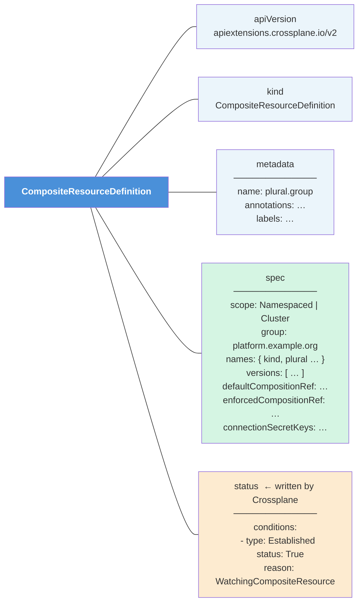
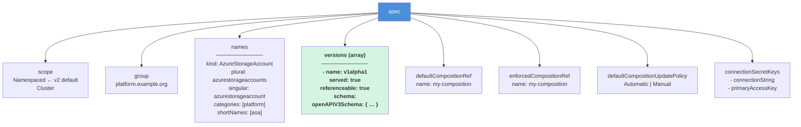

# Diagram: XRD Structure (Level 2 — Middle)

This diagram shows the **five top-level blocks** of an XRD and the key fields inside each.

---

## Expanded: spec fields

The `versions` array is where the real schema work happens — it contains the `openAPIV3Schema`. See the next diagram for a deep-dive into that.
