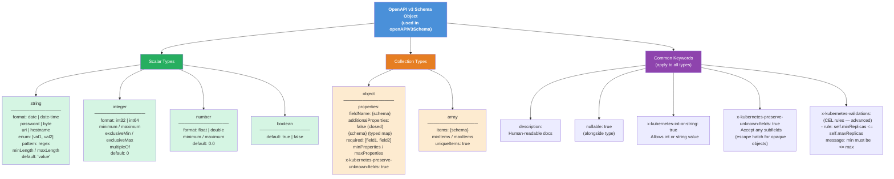
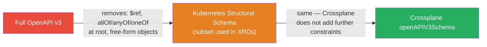

# Diagram: OpenAPI v3 Structural Schema Type System (Level 3)



---

## Quick reference: type + validation combinations

```
string  ──► enum          → validated list of allowed values
string  ──► pattern       → regex validation
string  ──► format        → semantic hint (date-time, uri, etc.)
string  ──► min/maxLength → length bounds
integer ──► minimum       → number lower bound (inclusive)
integer ──► maximum       → number upper bound (inclusive)
object  ──► properties    → typed known fields
object  ──► additionalProperties: {type: string} → string map (tags pattern)
object  ──► required      → mandatory field list (sibling to properties)
array   ──► items         → element schema
array   ──► minItems      → require at least N elements
```

---

## Structural schema constraint visualised



### What structural schema removes from full OpenAPI v3

| Removed | Reason |
|---------|--------|
| `$ref` to external schemas | No remote schema resolution |
| `allOf` / `anyOf` / `oneOf` replacing `properties` | Must always have explicit properties at each level |
| Objects without `type` | Every node must be explicitly typed |
| Free-form JSON (without `x-kubernetes-preserve-unknown-fields`) | Kubernetes prunes unknown fields |
