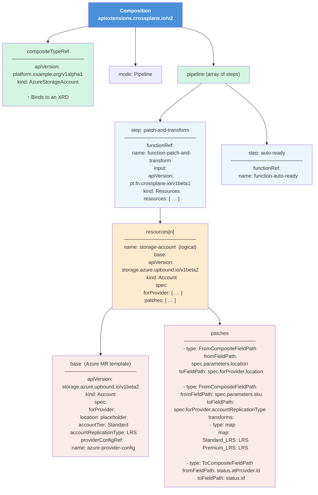
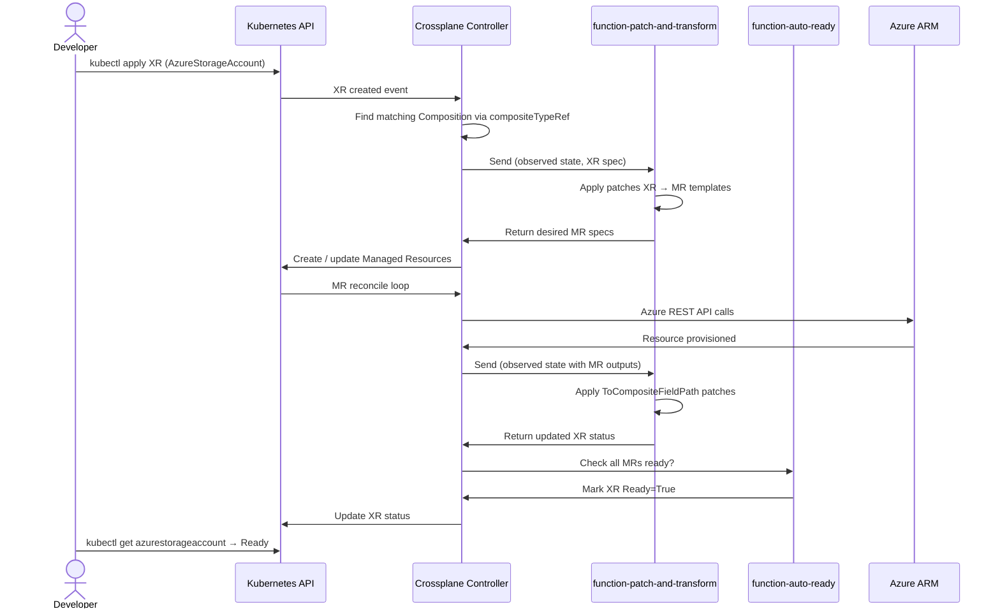

# Diagram: Composition Structure (Level 2)

```mermaid
graph TD
    COMP["Composition\napiextensions.crossplane.io/v2"]

    CTR["compositeTypeRef\n────────────────────\napiVersion: platform.example.org/v1alpha1\nkind: AzureStorageAccount\n\n↑ Binds to an XRD"]

    MODE["mode: Pipeline"]

    PIPE["pipeline  (array of steps)"]

    STEP1["step: patch-and-transform\n────────────────────\nfunctionRef:\n  name: function-patch-and-transform\ninput:\n  apiVersion: pt.fn.crossplane.io/v1beta1\n  kind: Resources\n  resources: [ … ]"]

    STEP2["step: auto-ready\n────────────────────\nfunctionRef:\n  name: function-auto-ready"]

    RES["resources[n]\n────────────────────\nname: storage-account  (logical)\nbase:\n  apiVersion: storage.azure.upbound.io/v1beta2\n  kind: Account\n  spec:\n    forProvider: { … }\npatches: [ … ]"]

    BASE["base  (Azure MR template)\n────────────────────\napiVersion: storage.azure.upbound.io/v1beta2\nkind: Account\nspec:\n  forProvider:\n    location: placeholder\n    accountTier: Standard\n    accountReplicationType: LRS\n  providerConfigRef:\n    name: azure-provider-config"]

    PATCHES["patches\n────────────────────\n- type: FromCompositeFieldPath\n  fromFieldPath: spec.parameters.location\n  toFieldPath: spec.forProvider.location\n\n- type: FromCompositeFieldPath\n  fromFieldPath: spec.parameters.sku\n  toFieldPath: spec.forProvider.accountReplicationType\n  transforms:\n    - type: map\n      map:\n        Standard_LRS: LRS\n        Premium_LRS: LRS\n\n- type: ToCompositeFieldPath\n  fromFieldPath: status.atProvider.id\n  toFieldPath: status.id"]

    COMP --> CTR
    COMP --> MODE
    COMP --> PIPE
    PIPE --> STEP1
    PIPE --> STEP2
    STEP1 --> RES
    RES --> BASE
    RES --> PATCHES

    style COMP fill:#4A90D9,color:#fff,font-weight:bold
    style CTR fill:#D5F5E3
    style PIPE fill:#D5F5E3
    style STEP1 fill:#EBF5FB
    style STEP2 fill:#EBF5FB
    style RES fill:#FDEBD0
    style BASE fill:#F9EBEA
    style PATCHES fill:#F9EBEA
```

---

## Data flow through a Composition

```mermaid
sequenceDiagram
    actor Dev as Developer
    participant K8s as Kubernetes API
    participant XP as Crossplane Controller
    participant FPT as function-patch-and-transform
    participant FAR as function-auto-ready
    participant AZ as Azure ARM

    Dev->>K8s: kubectl apply XR (AzureStorageAccount)
    K8s->>XP: XR created event
    XP->>XP: Find matching Composition via compositeTypeRef
    XP->>FPT: Send (observed state, XR spec)
    FPT->>FPT: Apply patches XR → MR templates
    FPT->>XP: Return desired MR specs
    XP->>K8s: Create / update Managed Resources
    K8s->>XP: MR reconcile loop
    XP->>AZ: Azure REST API calls
    AZ->>XP: Resource provisioned
    XP->>FPT: Send (observed state with MR outputs)
    FPT->>FPT: Apply ToCompositeFieldPath patches
    FPT->>XP: Return updated XR status
    XP->>FAR: Check all MRs ready?
    FAR->>XP: Mark XR Ready=True
    XP->>K8s: Update XR status
    Dev->>K8s: kubectl get azurestorageaccount → Ready
```
