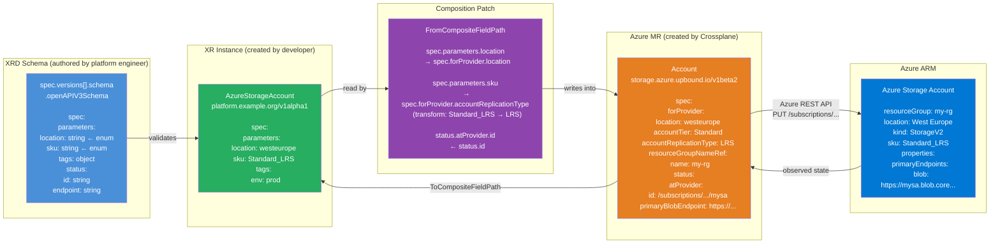

# Diagram: XRD → Composition → MR → Azure ARM (End-to-End)

This diagram shows **how schema knowledge flows** from the XRD definition right through to Azure ARM API calls.



---

## Field name mapping: XRD → Azure ARM

| XRD field (what developer sets) | Composition patch | MR forProvider field | Azure ARM property |
|--------------------------------|------------------|---------------------|-------------------|
| `spec.parameters.location` | direct copy | `spec.forProvider.location` | `location` |
| `spec.parameters.sku` | map transform | `spec.forProvider.accountReplicationType` | `sku.name` |
| `spec.parameters.tags` | direct copy | `spec.forProvider.tags` | `tags` |
| *(set in Composition base)* | — | `spec.forProvider.accountTier` | `sku.tier` |
| *(set in Composition base)* | — | `spec.forProvider.minTlsVersion` | `properties.minimumTlsVersion` |

---

## The schema "stack"

```
OpenAPI v3 Structural Schema (standard)
        │
        ▼
Kubernetes CRD structural schema (subset of OpenAPI v3)
        │
        ▼
Crossplane XRD openAPIV3Schema (same as CRD structural schema)
        │  validates
        ▼
Your XR instance (developer YAML)
        │  patches map to
        ▼
Azure MR spec.forProvider (from provider CRD — also OpenAPI v3)
        │  reconciled to
        ▼
Azure ARM REST API (OpenAPI 2.0 / Swagger internally)
```

The schema language is consistent top to bottom: everything is OpenAPI v3 (or a subset). The provider CRDs (Azure MR schemas) are generated directly from the Azure REST API specification.
